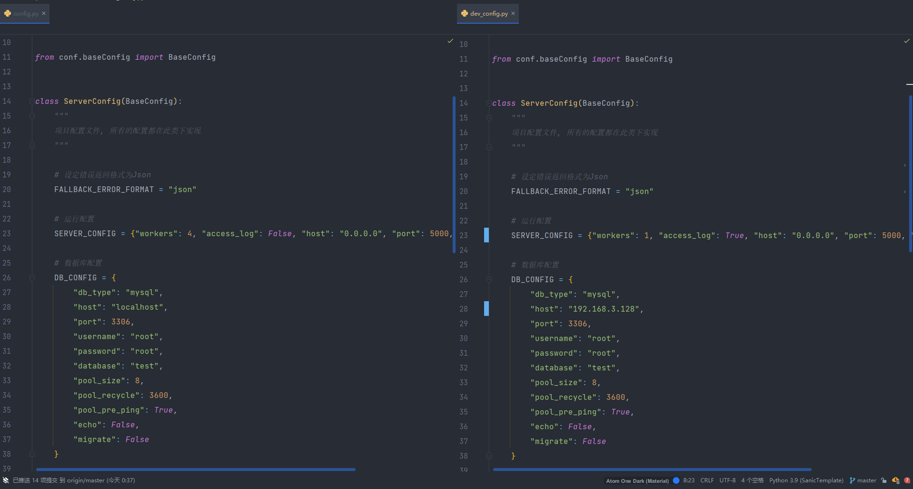
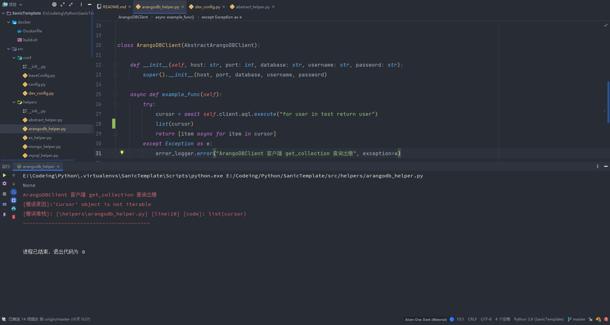
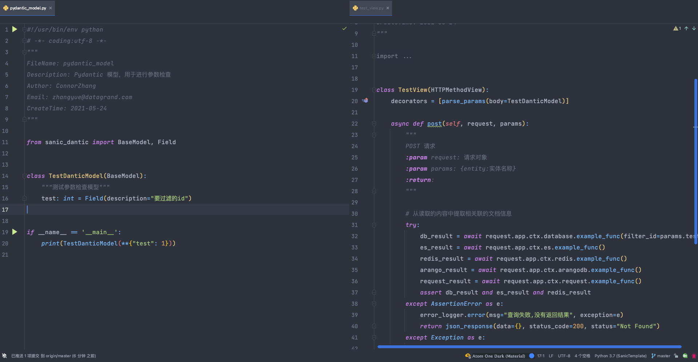
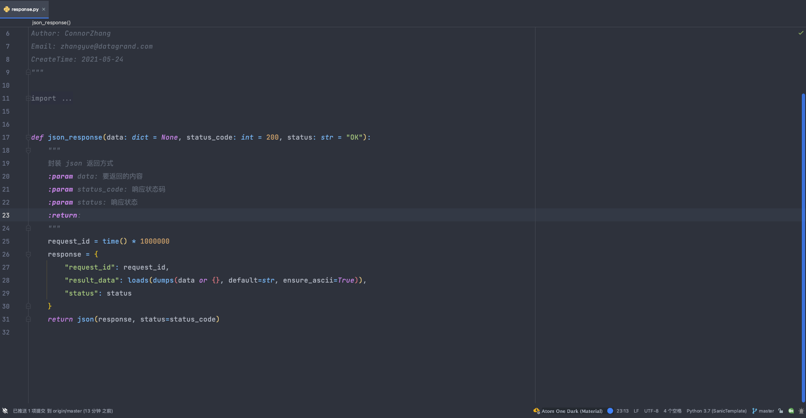
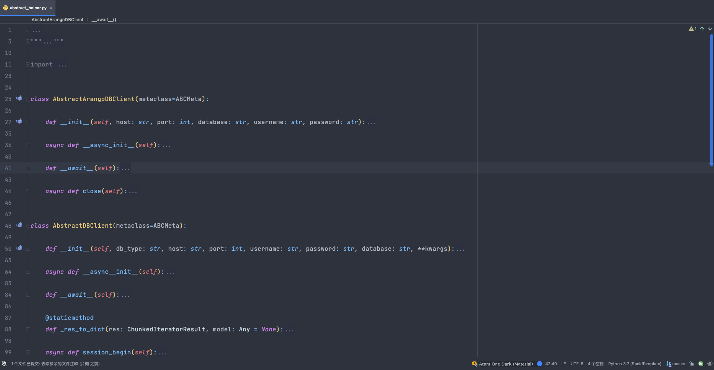

# SanicTemplate 项目

## 配置要求

Python3.7+
Docker 19.06+

## 项目简介

SanicTemplate 是基于 Sanic 的 Web 开发框架，该项目帮助完成了Sanic项目模板的封装。项目特点:

1. 封装了 config 与 dev_config 将生产环境配置和测试环境配置进行隔离



2. 封装了 全新的错误打印日志格式，方便错误回溯，兼顾美观与实用。



3. 封装了 sanic-dantic 请求参数检查工具



4. 封装了 json_response 返回函数



5. 封装了 ArangoDB / EsClient / MongoDB / SQLAlchemy / Redis / AioHttp 等常用的异步客户端工具



## 项目目录

```text
.
├── README.md
├── deploy                      # 部署文件夹
│   ├── restart.sh
│   ├── shutdown.sh
│   └── start.sh
├── docker                      # Docker 构建文件夹
│   ├── Dockerfile
│   └── build.sh
├── requirements.txt            # 依赖包文件
├── src
│   ├── __init__.py
│   ├── conf                    # 配置文件夹
│   │   ├── __init__.py
│   │   ├── baseConfig.py      
│   │   ├── config.py           
│   │   └── dev_config.py       
│   ├── helpers                 # 异步客户端文件夹
│   │   ├── __init__.py
│   │   ├── abstract_helper.py
│   │   ├── arangodb_helper.py
│   │   ├── es_helper.py
│   │   ├── mongo_helper.py
│   │   ├── mysql_helper.py
│   │   ├── redis_helper.py
│   │   └── request_helper.py
│   ├── logs                    # 日志文件夹
│   │   ├── error.log
│   │   └── info.log
│   ├── middlewares             # 中间件文件夹
│   │   ├── __init__.py
│   │   ├── abstract_middleware.py
│   │   ├── request_middlewares.py
│   │   └── response_middlewares.py
│   ├── models                  # 模型文件夹
│   │   ├── __init__.py
│   │   ├── pydantic_model.py
│   │   └── sqlalchemy_model.py
│   ├── route.py                # 路由文件
│   ├── runserver.sh            # 项目运行脚本
│   ├── server.py               
│   ├── utils                   # 独立工具文件夹
│   │   ├── __init__.py
│   │   ├── logger.py
│   │   └── response.py
│   └── views                   # 视图文件夹件
│       ├── __init__.py
│       └── test_view.py
└── test                        # 测试文件夹
    ├── __init__.py
    ├── store.zip
    └── test.py
```

## 使用指导

### 修改配置文件

您可以通过当前所属的不同阶段，修改 `src/conf/__init__.py` 文件中的 `Develop` 参数切换不同的环境配置。

### 添加中间件

在 middleware 文件夹下，有 request_middleware 和 response_middleware 两个文件，对应的中间件类下进行中间件的定义即可。需要注意的是：

每个类下都有 MIDDLEWARES 类属性，用于定义中间件的执行顺序，在请求中间件中，执行顺序从前到后。
在响应中间件中，执行顺序从后到前，更多内容请查看 [中间件](https://sanicframework.org/zh/guide/basics/middleware.html#%E4%B8%AD%E9%97%B4%E4%BB%B6-middleware)

### 使用 sanic-dantic 进行参数检查

在 models 下有一个 pydantic_model.py 文件，该文件下放置 pydantic 类，用于参数检查。定义完成之后，在 view 视图中添加 `decorators = [parse_params
(body=PyDanticModel)]` 即可启用，具体使用方式请参考 [sanic-dantic 官方文档](https://miss85246.github.io/sanic-dantic/)

### 使用 SQLAlchemy 进行数据库关系映射

嘿，您猜怎么着? SQLAlchemy 已经帮您封装好了异步客户端了，模型的定义还是原来的样子，继续按照以前的方法进行愉快玩耍吧

### 独立工具

在 utils 文件夹下，存放的均为独立工具，该文件夹下的工具应具备独立，开箱即用的特性，即除了依赖 pip 安装的包之外，不依赖任何项目内的文件，能够保证即便复制粘贴到另一个项目中，依旧可以立刻使用。

### 视图文件

在 Django 中，推荐使用一个 `views.py` 文件，但是当接口众多的时候，维护与查看非常困难。在 SanicTemplate 中，作者推荐使用 views 文件夹，每一个视图使用一个文件，
或每一个功能点的增删改查使用一个文件，这样方便代码查看，也方便后期维护。

### 路由挂载

在 Sanic 中，同样具备蓝图的概念，在 `route.py` 文件中，您可以尽情的声明蓝图和挂载视图，只要保证最后挂载到蓝图组中即可。

### 项目启动

SanicTemplate 为您准备了 deploy 文件夹，该文件夹下包含了 启动 / 停止 / 重启 脚本，直接使用即可。

### 项目测试

在 test 文件夹下，配置了 test.py 文件，该文件使用了 sanic 的 test_client，通过 test_client 您可以轻松的对视图进行测试,而不需要频繁地去自己手动启动/关闭项目

### 项目部署

SanicTemplate 为您准备了 docker 文件夹，该文件夹会帮您自动生成 Docker 镜像，并自动上传到 dockerhub，您只需配置自己项目名称和 TAG_PREFIX 即可

## 试用指导

如果您以前没有用过 sanic，请不要担心这里为您提供了完整的试用指导:

1. 解压 `test/store.zip`，并进入到解压目录

```shell
cd ./test || exit
unzip store.zip
cd store
```

2. 使用 `docker-compose` 运行对应内容

```shell
docker create network -d bridge store
docker-compose up -d
```

3. 如果 不想使用 `docker-compose` 进行部署，可以使用编写好的脚本进行启动
```shell
sh start.sh
```

4. 前置工作准备完成之后，即可准备启动 Web 服务:

```shell
cd ../deploy 
sh start.sh
```

5. 进行访问测试:

```shell
cd ../test
python3 test.py
```

## 参与贡献

如果您希望参与项目，请联系 [ConnorZhang](chzhangyue@outlook.com)

## 更多 Sanic 的使用指导

如果您希望更深一步的了解 Sanic 具有哪些特性，如何调优，请参考 [Sanic官方文档](https://sanicframework.org/zh/)。 目前已全面支持中文文档，看起来更省力!

